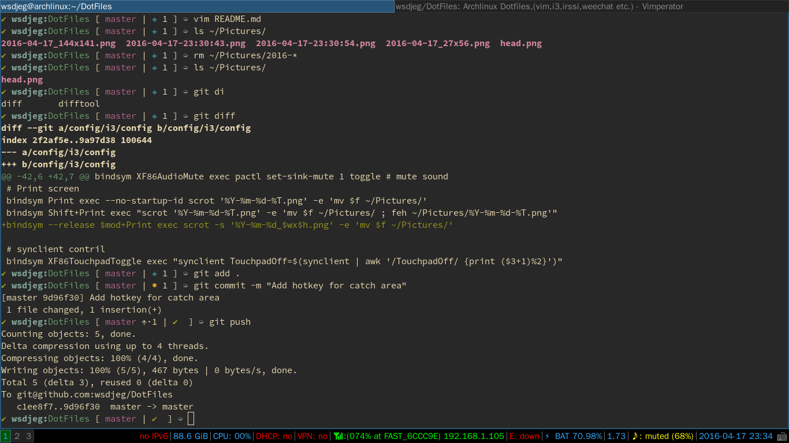
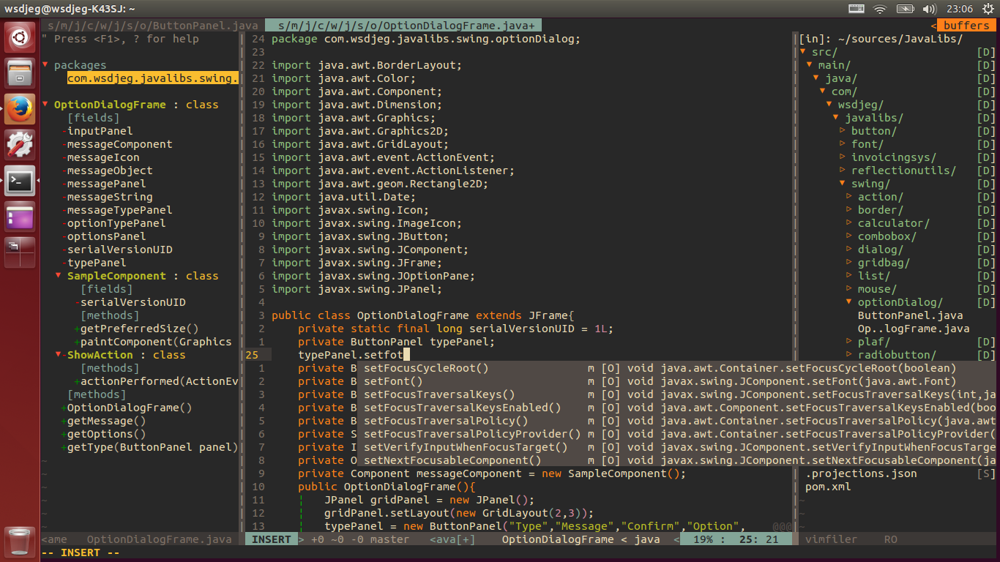
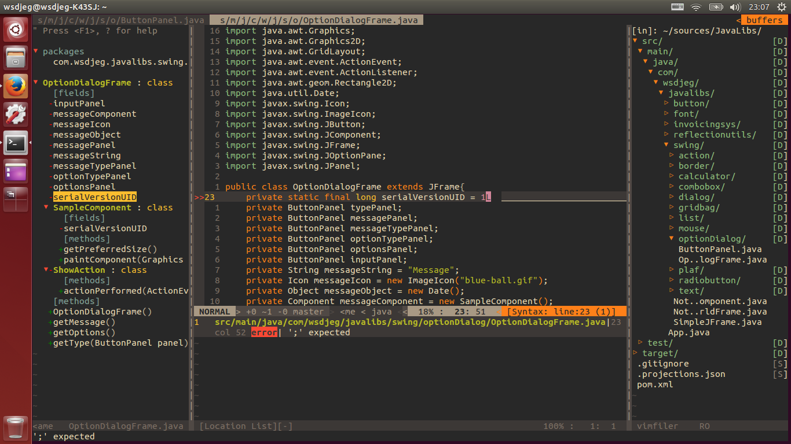
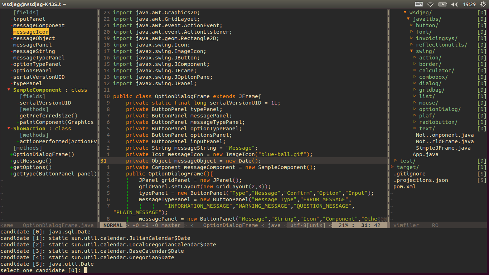
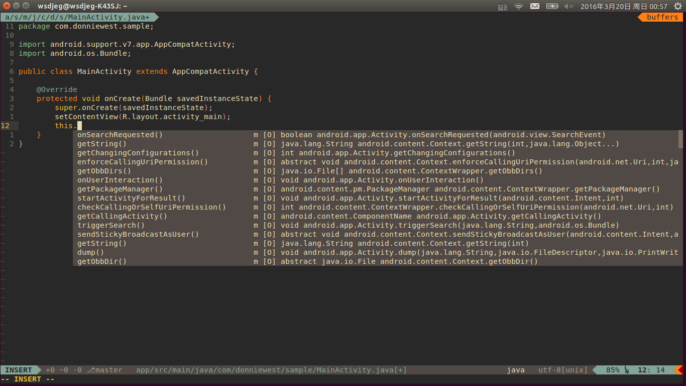

# awesome-dotfiles

## Screenshots











### Requirements

1. jdk 1.8
2. Vim 7.3.885+ compiled with lua. If :echo has("lua") returns 1, then you're done;
3. Recommend to use [neovim](https://neovim.io/)
4. mutt getmail procmail msmtp


### Install

##### Linux
you can use the install.sh script for vim or neovim;

```sh
chmod +x install.sh
./install.sh nvim  # or ./install.sh vim
```
### Docs

- VIM [README.md](config/nvim)

### Thanks

- [deoplete.nvim](https://github.com/Shougo/deoplete.nvim)

> Dark powered asynchronous completion framework for neovim

- [javacomplete2](https://github.com/artur-shaik/vim-javacomplete2)

> Updated javacomplete plugin for vim

- [neosnippet.vim](https://github.com/Shougo/neosnippet.vim)

> neo-snippet plugin contains neocomplcache snippets source

